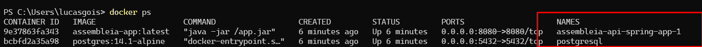

# Assembleia API

No cooperativismo, cada associado possui um voto e as decisões são tomadas em assembleias, por votação. Imagine que você deve criar uma solução para dispositivos móveis para gerenciar e participar dessas sessões de votação.

Essa solução deve ser executada na nuvem e promover as seguintes funcionalidades através de uma API REST:

- Cadastrar uma nova pauta
- Abrir uma sessão de votação em uma pauta (a sessão de votação deve ficar aberta por um tempo determinado na chamada de abertura ou 1 minuto por default)
- Receber votos dos associados em pautas (os votos são apenas 'Sim'/'Não'. Cada associado é identificado por um id único e pode votar apenas uma vez por pauta)
- Contabilizar os votos e dar o resultado da votação na pauta

  Para fins de exercício, a segurança das interfaces pode ser abstraída e qualquer chamada para as interfaces pode ser considerada como autorizada. A solução deve ser construída em java, usando Spring-boot, mas os frameworks e bibliotecas são de livre escolha (desde que não infrinja direitos de uso).

É importante que as pautas e os votos sejam persistidos e que não sejam perdidos com o restart da aplicação.

## Informações
* Documentação da API - // adicionar

## Para rodar localmente
* Ao rodar o projeto localmente verificar a porta do postgresql, username e password no arquivo application.properties

* Necessário instalar o banco postgres, caso tenha o docker instalado na máquina, basta acessar a raiz do projeto 
e rodar o comando:
* `./start.sh` - Cria as imagens e o comando docker compose up será executado(Se estiver no windows usar o gitbash para rodar o comando)

* `docker ps` - Verifica se os containers estão no ar

* Endereço local: http://localhost:8080/assembleia
* Endereço local Swagger: http://localhost:8080/assembleia/swagger-ui/index.html

## Passos para uso da API
* 1- Acessar o swagger/postman
* 2- Criar uma Pauta
* 3- Abrir uma nova sessão
* 4- Realizar um voto
* 5- Acessar o resultado da votação

## Tecnologias
* Java 17
* Spring boot 3.3.0
* Spring data
* OpenAPI (Documentação da API)
* Postgres
